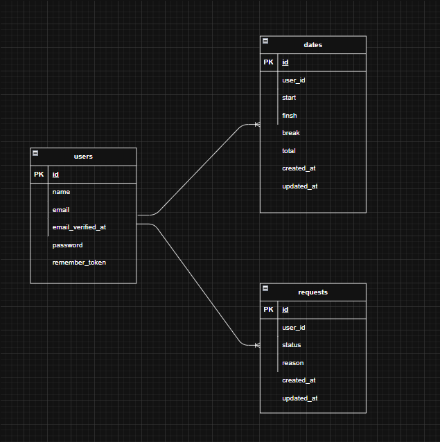

# アプリケーション名
勤怠管理サイト

## Dockerビルド
１, git@github.com:wyjuly12/Attendance.git
２，docker-compose up -d --build

## 環境構築
１，docker-compose exe php bash　　
２，composer install　　
３，.env.exampleファイルから.envを作成して環境変数を変更　　
４，php artisan key:generate　　
５，php artisan migrate　　
６，php artisan db:seed　　

## 使用技術(実行環境)
　Laravel 8.83.8　　

## ER図

## URL
開発環境：http://localhost/
